# WhereIsHome_Vue : 강수지 , 조민수

민수와 수지의 행복한 부동산 커뮤니티

### 애자일 ! 진행사항 정리

- 11/17 - 11/19 : 아래 기능 구현
- 11/19 - 11/23 : 추가 기능 구현

_진행사항_
| 기능 | 진행사항 | 담당 |
| :--------------------: | :--------------------: | :--------------------: |
| 로그인 | DB 사용자 로그인 . . . 소셜 로그인 API | 민수 |
| 회원가입 | DB 사용자 등록, 소셜 회원가입 API | 민수 |
| About | ~~about us => about 으로 수정, 사진 슬라이드쇼 추가하기 , 소개 멘트 . .~~ | 수지 |
| 게시판 | 파일 업로드, 사진 업로드시 사진 보이게 . . | 수지 |
| 주택 실거래 검색 | 지도 붙이기, ~~시도구군으로 검색하도록 변경~~ + 추가 이슈 ( 시도구군 검색 싱크가 안맞는다 . . ) | 수지 |
| chatbot | 챗봇 붙이기 | 미정 |

## 요구사항

_기능적 요구사항_
| 기능 | 기능적 요구사항 |
| :--------------------: | :-------------------------------------------------------------: |
| 주택 실거래가 정보수집 | 국토교통부 : 실거래가 정보 ( xlsx ) 활용 데이터 가공 후 DB 저장 |
| 주택 실거래가 검색 | 주택 실거래가 정보를 원하는 검색 정보에 따라 검색 결과 데이터 제공 |
| 로그인 | DB 유저 정보가 있는지 확인 후 로그인 |
| 회원관리 | 회원정보 가입, 수정, 탈퇴 |
| 게시판 기능 | 게시판 글목록, 글작성, 글수정, 글삭제 상세기능 제공 |
| 채팅 기능 | 커뮤니티 조성을 위한 실시간 채팅 기능 |

_비기능적 요구사항_
| 기능 | 비기능적 요구사항 |
| :--------------------: | :-------------------------------------------------------------: |
| 공공데이터의 정확성 | 공공데이터 API를 활용함으로 인한 공공데이터의 정확성이 요구됨 |
| Client - Server 구조 | Rest API 적용 |
| 응답성 | 검색에 대한 결과를 빠르게 응답해야 함 |
| 사용성 | 웹 사이트에 대한 사전 지식이 없어도 쓰기 편해야함 |
| 가용성 | 언제나 어떤 디바이스로든 서비스가 가능해야 함 |
| 안전성 | 회원정보가 암호화되어 DB에 저장되어야 함 |

---

# 화면 설계

## 📌 Home

- 홈화면의 search for 클릭시 주택실거래가 검색 페이지로 이동
- 홈화면의 배너 About 은 사이트의 소개, AptInfo 는 주택실거래가 검색, Board 게시판 구성

  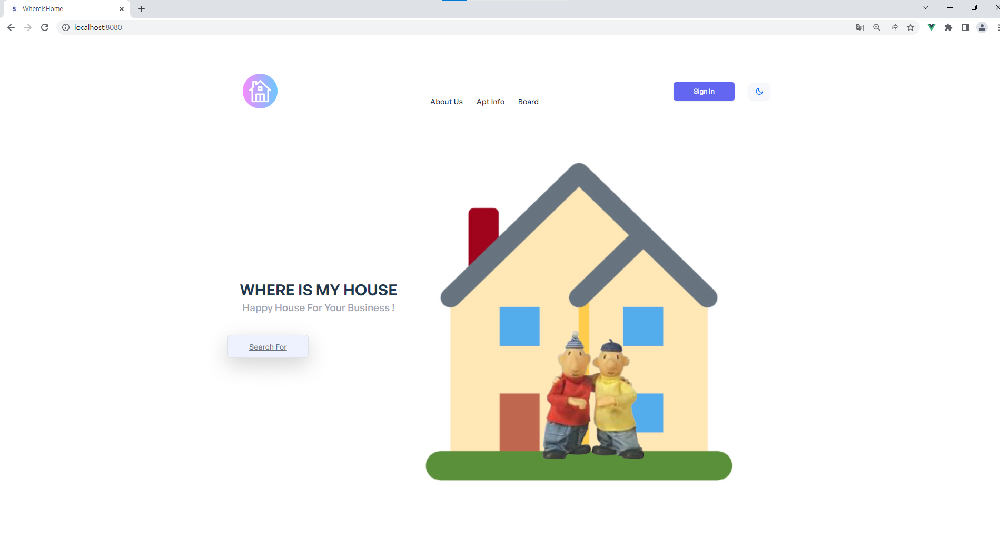

## 📌 Login

- 홈화면의 오른쪽 상단 회원가입, 로그인
- 홈화면 오른쪽 상단 input 으로 로그인

  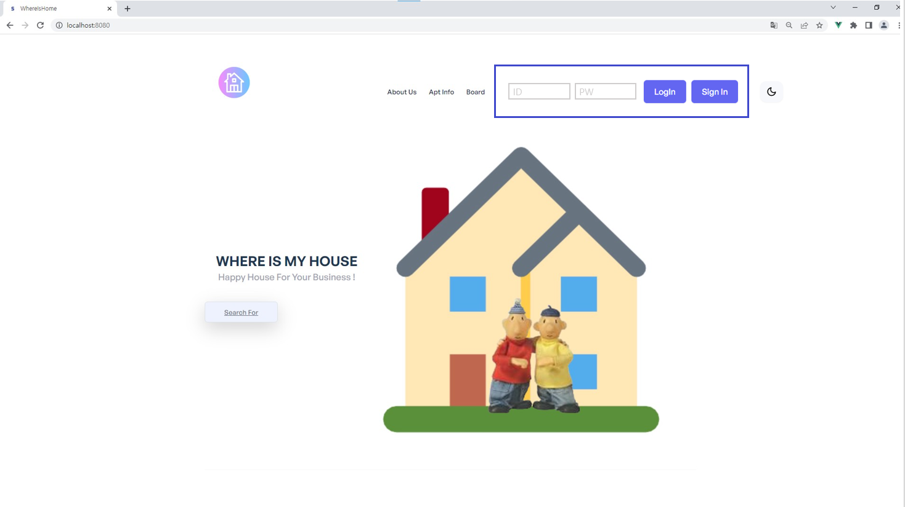

## 📌 Sign up

- 이름, email, 비밀번호를 입력하여 사이트의 회원가입할 수 있는 모달창

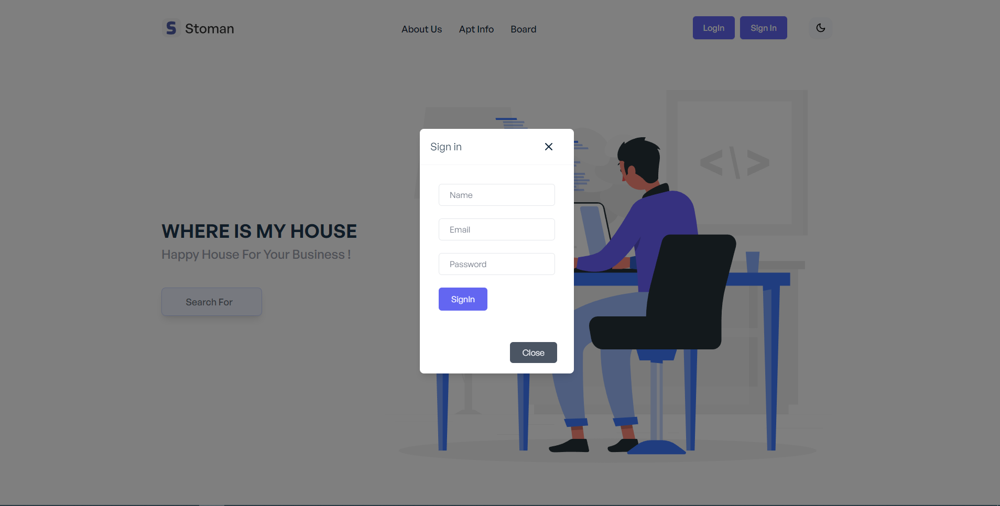

## 📌 About

- 소개와 사이트 기능 등 사이트 소개페이지

  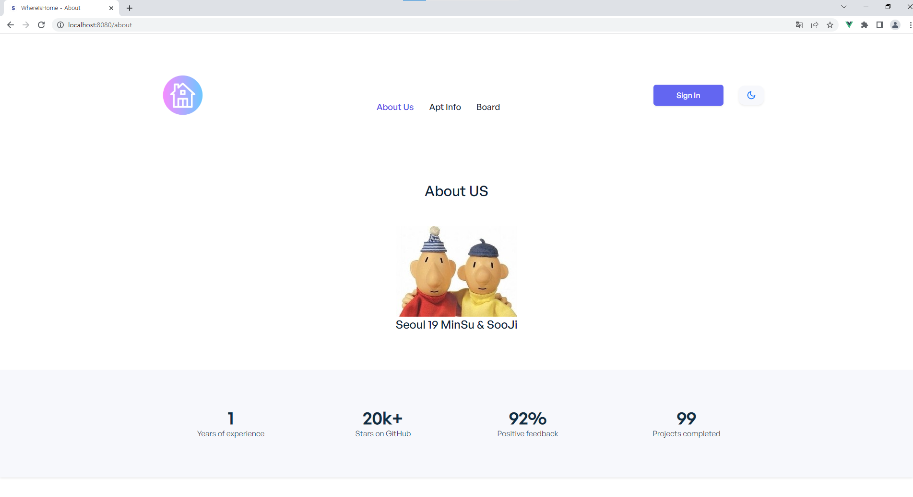

---

## 📌 Apt Info

- 시군동 등으로 검색이 가능한 주택실거래가 검색 페이지
- 차후 아파트 사진과 지도 추가 예정, 검색한 결과표 위치 고민중

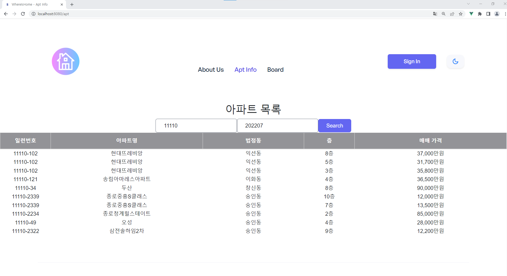

---

## 📌 Board

글 목록

- DB의 board 를 통해 게시판의 글 목록을 불러옴
- 오른쪽 상단의 post 를 통해 글 작성 가능

  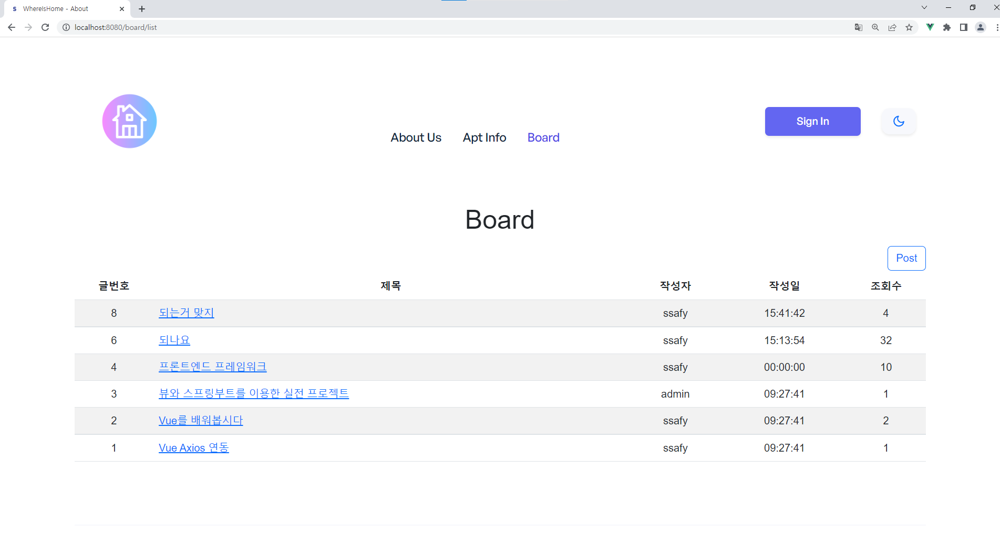

글 등록

- 작성자, 글제목, 글내용으로 화면 구성
- 차후 파일 업로드 기능 추가 예정

  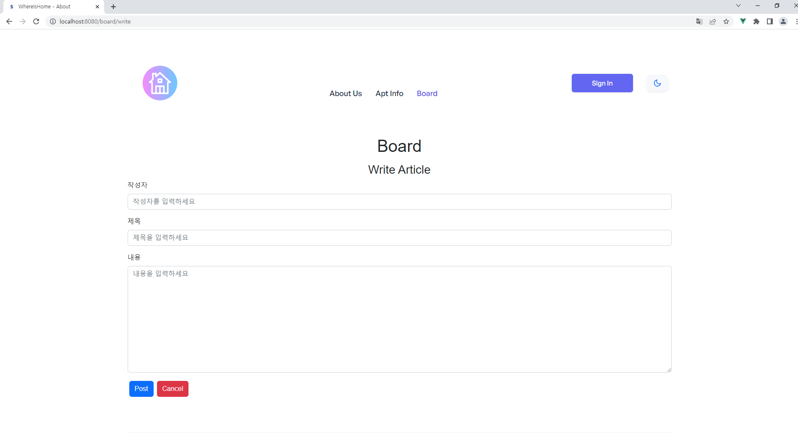

글 상세보기

- 목록에서 글 제목을 선택하는 경우에 해당 글을 상세보기 할 수 있도록 구현
- 글제목 , 작성자와 hit, 글 작성시간 , 글 내용 등으로 구성
- 차후 사진 추가 예정

  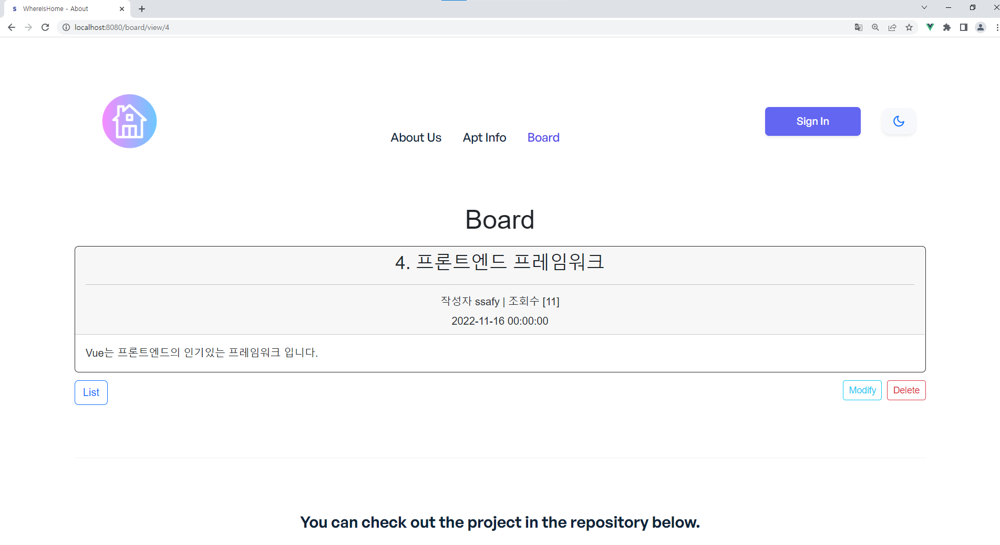

글 수정

- DB의 해당 게시글의 내용을 얻어와서 수정할 수 있는 화면구성
- 하단의 modify 버튼을 통해 수정 완료
- 하단 우측의 cancel 버튼을 누르면 board list 로 이동

  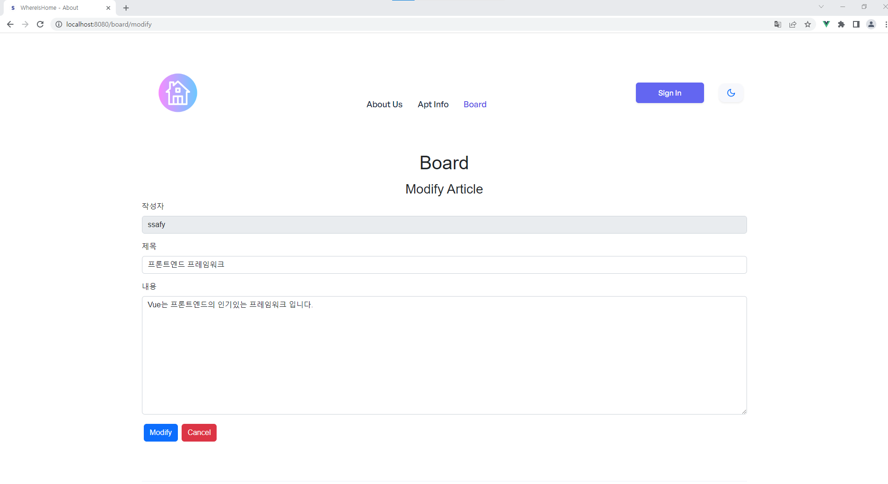

글 삭제

- 글 상세보기 오른쪽 하단의 delete 버튼을 선택하는 경우 db의 글 삭제 가능
- 알림 경고창을 통해 삭제 기능을 구현할지 선택하도록 화면 구성
  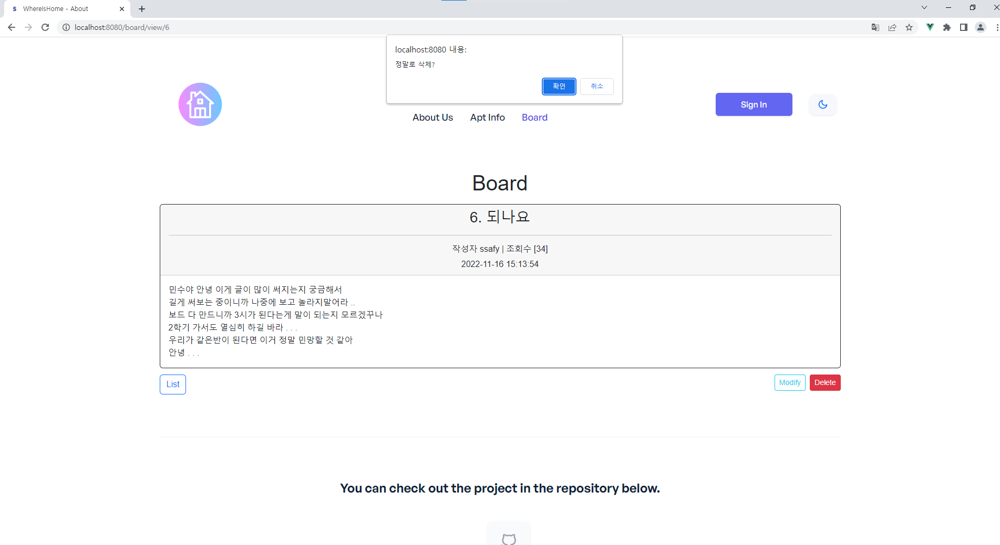

글 삭제완료

- 글이 삭제되는 경우 db에서도 해당 글이 삭제되고 게시판 목록으로 이동
  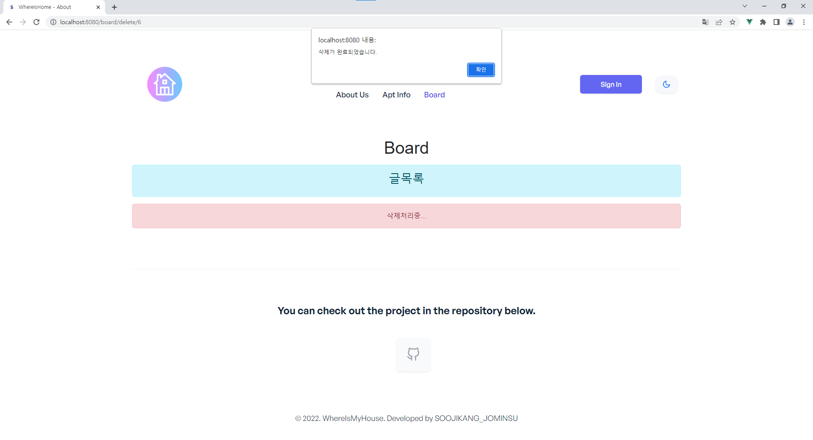

---

## 📌 Chat

- 오른쪽 하단의 챗봇이 위치하도록 화면구성
- 버튼을 선택하는 경우 챗봇이 실행될 수 있도록 구현할지 아직 상의중 !
  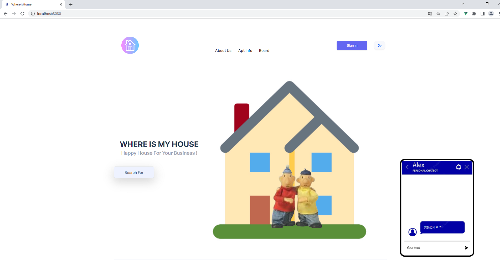

---

# ERD

#### 데이터의 모델링

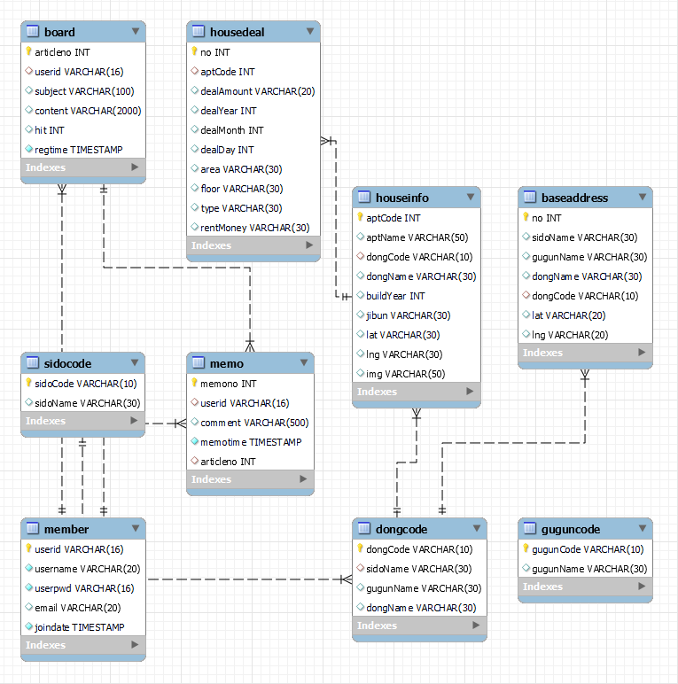

---

# Usecase

#### 행위자와 요구사항의 수행과정

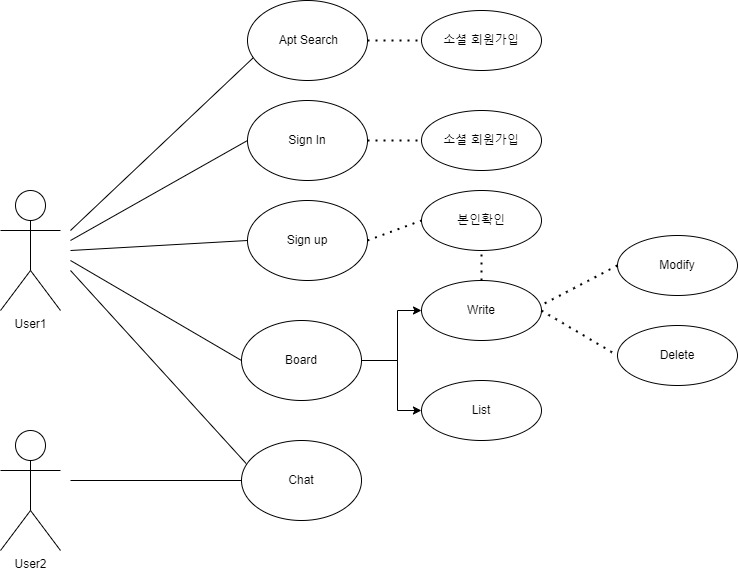
