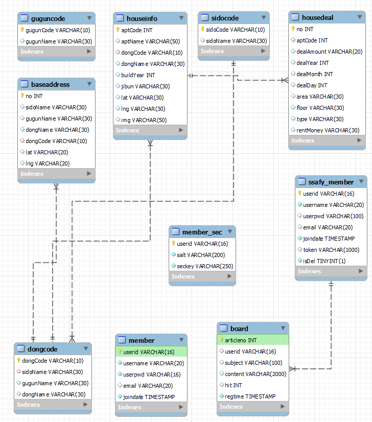

# WhereIsHome_Vue : 강수지 , 조민수

민수와 수지의 행복한 부동산 커뮤니티

### 애자일 !

## 요구사항

_기능적 요구사항_
| 기능 | 기능적 요구사항 |
| :--------------------: | :-------------------------------------------------------------: |
| 주택 실거래가 정보수집 | 국토교통부 : 실거래가 정보 ( xlsx ) 활용 데이터 가공 후 DB 저장 |
| 주택 실거래가 검색 | 주택 실거래가 정보를 원하는 검색 정보에 따라 검색 결과 데이터 제공 |
| 로그인 | DB 유저 정보가 있는지 확인 후 로그인 |
| 회원관리 | 회원정보 가입, 수정, 탈퇴 |
| 게시판 기능 | 게시판 글목록, 글작성, 글수정, 글삭제 상세기능 제공 |
| 채팅 기능 | 커뮤니티 조성을 위한 실시간 채팅 기능 |

_비기능적 요구사항_
| 기능 | 비기능적 요구사항 |
| :--------------------: | :-------------------------------------------------------------: |
| 공공데이터의 정확성 | 공공데이터 API를 활용함으로 인한 공공데이터의 정확성이 요구됨 |
| Client - Server 구조 | Rest API 적용 |
| 응답성 | 검색에 대한 결과를 빠르게 응답해야 함 |
| 사용성 | 웹 사이트에 대한 사전 지식이 없어도 쓰기 편해야함 |
| 가용성 | 언제나 어떤 디바이스로든 서비스가 가능해야 함 |
| 안전성 | 회원정보가 암호화되어 DB에 저장되어야 함 |

---

# 화면 설계

## 📌 Home ( O )

  

## 📌 Login ( X : modal 수정중 )

_이미지 첨부예정_

## 📌 Sign up ( X : modal 수정중 )

_이미지 첨부예정_

## 📌 About ( O )

  

---

## 📌 Apt Info ( X : 지역코드, 기간으로 검색만 가능한 상태 )

  

---

## 📌 Board ( O )

  

---

## 📌 Chat ( X : 기능 상의중 . . . )

_이미지 첨부예정_

# Function

## 주택실거래가 검색

- 주택 실거래가 정보를 원하는 검색 정보에 따라 검색 결과 데이터 제공
  

## 로그인 & 회원가입

- 수정중 ..

## 회원관리

- 수정중 ..

## 게시판 기능

#### 게시판 글목록, 글작성, 글수정, 글삭제 상세기능 제공

- 글 목록
  

- 글 등록
  

- 글 수정
  

- 글 삭제
  

- 글 삭제 성공 !
  

---

# ERD

#### 데이터의 모델링

